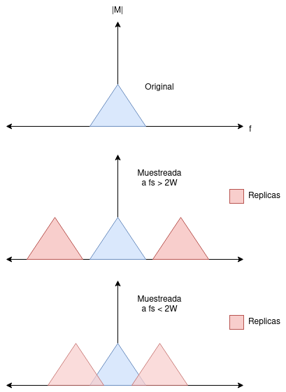
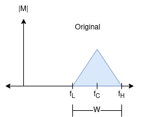
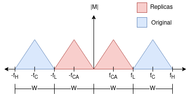
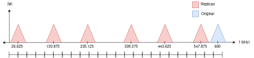

## Ejercicio 1: 

[Solución](hw2/audio.py)

## Ejercicio 2: 

[Solución](hw2/frequency.py)

## Ejercicio 3: 

[Solución](hw2/generator.py)

## Ejercicio 4

Analizar si el sistema es:

* Estático o dinámico
* Lineal o no lineal
* Invariante o variante en el tiempo
* Causal o no causal
* Estable o inestable

a. $y(n) = \cos[x(n)]$

* Estático: solo depende de la muestra presente.
* No lineal.

Debe soportar superposición:

A nivel de entrada: $x(n) = a_1x_1(n)+a_2x_2(n)$

$$
y(n) = \cos[a_1x_1(n)+a_2x_2(n)]
$$

A nivel de salida: $y(n) = a_1y_1(n) +a_2y_2(n)$

$$
y(n) = a_1y_1(n) +a_2y_2(n) \\
y(n) = a_1\cos[x_1(n)] + a_2\cos[x_2(n)]
$$

No son iguales, por lo tanto NO ES LINEAL.

* Invariante en el tiempo: invariante

Debe soportar desplazos en la entrada:

$$
y(n, k) = \cos[x(n-k)]
$$

Y en la salida:

$$
y(n-k) = \cos[x(n-k)]
$$

Son iguales, por lo tanto es INVARIANTE.

* Causal: Es causal, dado que solo depende de muestras actuales
* Estable: Es estable, dado que la función $\cos[\cdot] \to [-1, 1] \in \mathbb{R}$

b. $y(n) = x(n) cos(\omega_0 n)$

* Estático: solo depende de la muestra presente.
* Lineal

A nivel de entrada: $x(n) = a_1x_1(n)+a_2x_2(n)$

$$
y(n) = [a_1x_1(n)+a_2x_2(n)]\cos(\omega_0 n)
$$

A nivel de salida: $y(n) = a_1y_1(n) +a_2y_2(n)$

$$
y(n) = a_1y_1(n) +a_2y_2(n) \\
y(n) = a_1x_1(n)\cos(\omega_0 n) + a_2x_2(n)\cos(\omega_0 n) \\
y(n) = [a_1x_1(n)+a_2x_2(n)]\cos(\omega_0 n) \\
$$

No son iguales, por lo tanto ES LINEAL.

* Invariante en el tiempo

Debe soportar desplazos en la entrada:

$$
y(n, k) = x(n-k)\cos[\omega_0 n]
$$

Y en la salida:

$$
y(n-k) = x(n-k)\cos[\omega_0 (n - k)]
$$

No son iguales, por lo tanto es VARIANTE.

* Causal: Es causal, dado que solo depende de muestras actuales
* Estable

Seleccionando la entrada $x(n)=Au(n)$, para $A \in \mathbb{R}$ constante:

$$
y(n) = Au(n)\cos(\omega_0 n)
$$

la salida estará definida entre: $-A \le y(n) \le A$.

c. $y(n) = \text{Round}[x(n)]$

* Estático: solo depende de la muestra presente.
* No lineal

A nivel de entrada: $x(n) = a_1x_1(n)+a_2x_2(n)$

$$
y(n) = \text{Round}[a_1x_1(n)+a_2x_2(n)]
$$

A nivel de salida: $y(n) = a_1y_1(n) +a_2y_2(n)$

$$
y(n) = a_1y_1(n) +a_2y_2(n) \\
y(n) = \text{Round}[a_1x_1(n)] + \text{Round}[a_2x_2(n)]
$$

No son iguales, por lo tanto, NO ES LINEAL.

* Invariante en el tiempo

Debe soportar desplazos en la entrada:

$$
y(n, k) = \text{Round}[x(n-k)]
$$

Y en la salida:

$$
y(n-k) = \text{Round}[x(n-k)]
$$

Son iguales, por lo tanto, es INVARIANTE.

* Causal: Es causal, dado que solo depende de muestras actuales
* Estable: el operador ROUND solo extrae la parte entera. Para un escalón, estaría definido por $\text{ROUND}[A]$, donde $A$ es una constante real.

d. $y(n) = x(2n)$

* Estático: solo depende de la muestra presente.
* Lineal

A nivel de entrada: $x(n) = a_1x_1(n)+a_2x_2(n)$

$$
y(n) = a_1x_1(2n)+a_2x_2(2n)
$$

A nivel de salida: $y(n) = a_1y_1(n) +a_2y_2(n)$

$$
y(n) = a_1y_1(n) +a_2y_2(n) \\
y(n) = a_1x_1(2n) +a_2x_2(2n)
$$

No son iguales, por lo tanto ES LINEAL.

* Invariante en el tiempo

Debe soportar desplazos en la entrada:

$$
y(n, k) = x(2n-k)
$$

Y en la salida:

$$
y(n-k) = x(2(n-k))
$$

No son iguales, por lo tanto es VARIANTE.

* Causal: Es causal, dado que solo depende de muestras actuales
* Estable

# Ejercicio 5

* Respecto a la respuesta al impulso, se tiene que cada par de entrada salida tiene la forma:

$$
y(n) = h(n) \ast x(n)
$$

Para que se coumpla la respuesta al impulso, el tamaño de la salida tiene que tener un tamaño de:

$$
N_y = N_x + N_y - 1
$$

Dado que $x_1, x_2$ tienen un tamaño equivalente, y $y_1, y_2$ no lo tienen, se puede aseverar que el sistema no es LTI. Asimismo, con respecto a la respuesta al impulso, no se puede decir nada dado que el sistema no es LTI.

## Ejercicio 6

**Aplicación**: Submuestreo para filtros pasa bandas

De acuerdo con la tasa de Nyquist, una señal con ancho de banda $W$ debe ser muestrada al menos dos veces dicha frecuencia para evitar la pérdida de información:

$$
f_s \ge 2W
$$

Cuando $f_s < 2W$, las componentes espectrales de la información con mayor frecuencia comienzan a traslaparse con frecuencias de más baja frecuencia [1], tal como se ilustra en la siguiente imagen:

No obstante, en ocasiones, el submuestreo y el aliasing son un efecto deseado para la recuperación de señales cuya frecuencia central es muy alta pero su BW no abarca todo el espectro de frecuencias (véase la siguiente imagen). En este caso, la aplicación se da para filtros pasabanda. 

Uno puede crear intencionalmente _aliases_ de la señal para que se reconstruyan sus componentes espectrales a una menor frecuencia y, así, reducir las exigencias de rapidez de cómputo de un sistema. En este caso, la frecuencia de muestreo es inferior a la frecuencia central y debe seleccionarse de tal manera de que no exista traslape entre réplicas. Para satisfacer que las bandas no se superpongan causando pérdida de información, la frecuencia de muestreo (o submuestreo) debe cumplir el siguiente criterio [2]:

$$
\frac{2f_H}{n} \le f_s \le \frac{2f_L}{n-1}
$$

para cualquier entero $n$ tal que

$$
1 \le n \le \biggr\lfloor \frac{f_H}{f_H - f_L} \biggr \rfloor
$$

donde $\lfloor \cdot \rfloor$ es el truncamiento entero, $f_H$ es la frecuecia más alta del espectro y $f_L$ la más baja, dando como resultado $W = f_H - f_L$, un espectro centrado en $f_C = (f_H + f_L)/2$. 

El efecto que tiene el submuestreo es el de crear réplicas de la señal a más baja señal con el mismo contenido espectral, tal como se ilustra en la siguiente imagen:

Considerando un ejemplo práctico, donde $f_L = 575 kHz$, $f_H = 625 kHz$, con $f_C = 600 kHz$ que se quiere trasladar al origen. Verificando el cumplimiento de la tasa de Nyquist se tiene que

$$
W = f_H - f_L = 50 kHz
$$

por consiguiente $f_s \ge 2W = 100 kHz$.

Esto implica que la frecuencia de muestreo es menor que la frecuencia a la que está centrada la señal con ancho de banda $W$.

Tomando en cuenta el criterio establecido por [2]:

$$
1 \le n \le \biggr\lfloor \frac{f_H}{f_H - f_L} \biggr \rfloor \\
1 \le n \le \biggr\lfloor \frac{625 kHz}{50 kHz} \biggr \rfloor \\
1 \le n \le 12
$$

Utilizando $n=1$

$$
\frac{2f_H}{n} \le f_s \le \frac{2f_L}{n-1} \\
2\times 625 kHz \le f_s \le \infty \\
1250 kHz \le f_s \le \infty
$$

lo que da como resultado que cualquier frecuencia de muestreo igual o mayor a $1250 kHz$ permitirá reconstruir la señal, lo cual es la solución trivial de elevar la tasa de muestreo por encima de la componente espectral de mayor frecuencia.

Por otra parte, utilizando $n=12$

$$
\frac{2f_H}{n} \le f_s \le \frac{2f_L}{n-1} \\
\frac{2\times 625 kHz}{12} \le f_s \le \frac{2 \times 575 kHz}{12-1} \\
104.17 kHz \le f_s \le 104.54 kHz
$$

acotando la señal dentro de un rango con menos $379 Hz$. Seleccionando $f_s = 104.25 kHz$, la réplica se ubicará en:

* para la frecuencia más baja $f_{L,A}$

$$
f_{L,A} = f_L - \kappa f_s - f_2 / 2
$$

donde $\kappa = 5$ tal que $f_{L,A} \le f_s / 2$. Por lo tanto:

$$
f_{L,A} = 1.625 kHz
$$

* para la frecuencia más alta $f_{H,A}$

$$
f_{H,A} = f_H - \kappa f_s - f_2 / 2
$$

donde $\kappa = 5$ tal que $f_{H,A} \le f_s / 2$. Por lo tanto:

$$
f_{H,A} = 51.625 kHz
$$

en este caso, la señal con $50 kHz$ de ancho de banda queda con su máxima componente espectral en $51.625 kHz$ que es menor a $f_s/2 = 52.125 kHz$.

Finalmente, la frecuencia central está dada por

$$
f_{C,A} = (f_{L,A} + f_{H,A}) / 2 = 26.625 kHz
$$

Las demás replicas estarán centradas en cada múltiplo entero de $f_s$:

* $26.625 kHz$
* $130.875 kHz$
* $235.125 kHz$
* $339.375 kHz$
* $443.625 kHz$
* $547.875 kHz$

Una ilustración aproximada se presenta a continuación:

References:

1. walt kester, 2003, MIXED-SIGNAL AND DSP DESIGN TECHNIQUES
2. http://spazioscuola.altervista.org/UndersamplingAR/UndersamplingARnv.htm

